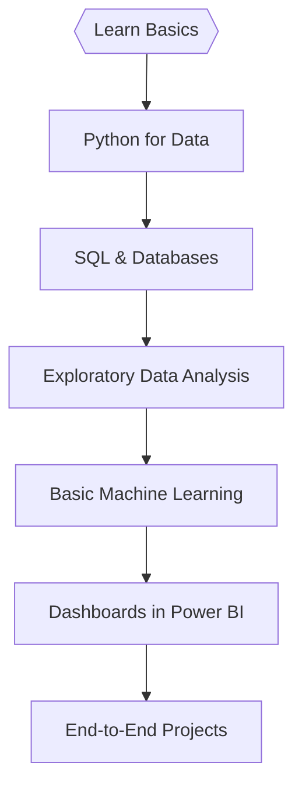

<!-- 🚀 Modern Animated Header | Data Science Learner -->

  

<h1 align="center">Hi, I'm Keerti Goyal! 👋</h1>

  <b>🚀 Data Science</b> &nbsp;|&nbsp; <b>📈 Aspiring Data Analyst</b> &nbsp;|&nbsp; <b>🧠 Python & Power BI</b>

---

## 🧬 About me

I enjoy turning raw, messy data into actionable insights using Python, Pandas, NumPy, and applied ML. I'm focused on building end-to-end projects that include data cleaning, exploratory analysis, modeling, and dashboarding with Power BI. I like to approach problems with curiosity and pragmatic solutions.

---

## 💡 Core Skills & Toolbox

- Languages & Libraries: Python, Pandas, NumPy, Matplotlib, Seaborn, scikit-learn
- Data: SQL, PostgreSQL, data cleaning, ETL basics
- Visualization & BI: Power BI, Matplotlib, Seaborn
- Tools & Cloud: Git, GitHub, Docker, basics of AWS
- Web & APIs: FastAPI (intro), REST APIs for data pipelines

  <!-- Example badges -->
  
  
  
  
  
  

---

## 🔭 Projects (high level)
A selection of end-to-end projects demonstrating data cleaning, EDA, modeling, and dashboards. I will add direct links to specific notebooks and dashboards — tell me which folders in this repo contain projects and I will list them automatically.

- Sales forecasting (time-series) — data cleaning, feature engineering, baseline models
- Customer segmentation — clustering and profiling with visual summaries
- Interactive Power BI dashboards — business KPIs and storytelling

---

## 📊 GitHub Stats

  
  
   
  

---

## 📡 Connect With Me

  
  

---

## 🌈 Final Thought

> Pipelines are like puzzles; ML is like magic.  
> Every new tool is a party, and every new problem is an invitation.  
> Trying to make tech more fun, fast, and fail-proof—one commit at a time.

---

  
   
  <i>Modern Analyst + DataScience by Keerti Goyal</i>

